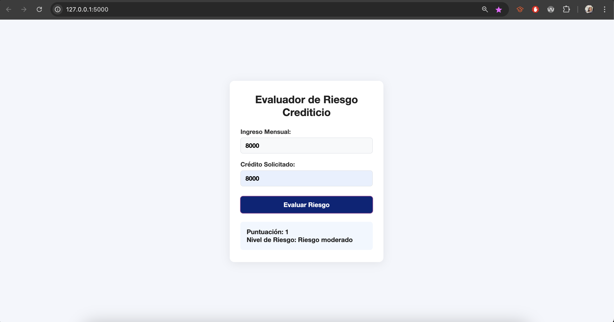

# Evaluador de Riesgo Crediticio

Aplicación web sencilla para calcular el riesgo crediticio de una persona en función de su ingreso mensual y el crédito solicitado.

## Vista previa

Así se ve la aplicación en funcionamiento:



**Nota:** No se incluyó la variable de edad en la evaluación para no modificar los umbrales de riesgo definidos originalmente.

## Instalación

1. Clona este repositorio o descarga los archivos.
2. Instala las dependencias:
   ```bash
   pip install -r requirements.txt
   ```

## Uso

1. Ejecuta la aplicación:
   ```bash
   python app.py
   ```
2. Abre tu navegador en [http://127.0.0.1:5000/](http://127.0.0.1:5000/)
3. Llena el formulario y consulta el resultado.

## Cómo funciona

### Cálculo de riesgo
La aplicación calcula el riesgo crediticio usando la siguiente fórmula:

**Puntuación = Ingreso mensual / Crédito solicitado**

### Categorías de riesgo
- **Bajo riesgo**: Puntuación > 1
- **Riesgo moderado**: Puntuación > 0.5
- **Riesgo alto**: Puntuación ≤ 0.5

### Redondeo
La puntuación se redondea automáticamente a **2 decimales** usando la función `round()` de Python para facilitar la lectura. Por ejemplo:
- Si ingresas $1000 y solicitas $300 de crédito: puntuación = 3.33

## Estructura del proyecto

- `app.py`: Backend principal con Flask.
- `static/`: Archivos del frontend (HTML, CSS, JS).
- `README.md`: Este archivo.
- `CHANGELOG.md`: Historial de cambios.
- `requirements.txt`: Dependencias del proyecto.

## Notas
- El frontend es responsivo y está separado en archivos HTML, CSS y JS.
- El backend expone una API `/evaluar` para calcular el riesgo. 